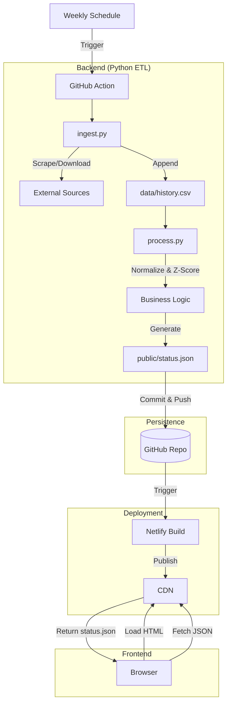

# Architecture Patterns

**Domain:** Automated Economic Dashboard (Serverless)
**Researched:** 2024-05-21

## Recommended Architecture

The system follows the **"Silent Automation"** pattern, leveraging GitHub Actions as a free compute engine and Git itself as the persistence layer.

### System Diagram



### Component Boundaries

| Component | Responsibility | Inputs | Outputs |
|-----------|---------------|--------|---------|
| **Ingest** | Fetch raw data, handle network failures, validate schemas. | External APIs/HTML | `data/history.csv` |
| **Process** | Business logic, normalization, Z-score math, "Traffic Light" mapping. | `data/history.csv` | `public/status.json` |
| **Persistence** | Version control, history tracking, trigger for deployment. | Files on disk | Git Commit |
| **Frontend** | Visualization only. Dumb rendering of provided state. | `status.json` | DOM / Canvas |

### Data Flow

1.  **Trigger:** GitHub Actions cron schedule (`0 0 * * 1`) initiates the workflow.
2.  **Extract:** Scripts download latest spreadsheets/scrape pages.
3.  **Transform:**
    *   Raw data appended to `history.csv` (The "Database").
    *   Pandas calculates rolling 10y mean/std-dev.
    *   Current values converted to Z-scores.
4.  **Load:** Final state written to `public/status.json`.
5.  **Publish:**
    *   Git `commit` & `push` updates the repo.
    *   Netlify detects change to `public/` and redeploys.
    *   User loads site, JS fetches new `status.json`.

## Patterns to Follow

### Pattern 1: Git as Database ("Flat Data")
**What:** storing structured data (CSV/JSON) directly in the git repository instead of an external database.
**When:** Data volume is low (<100MB), updates are infrequent (daily/weekly), and "Zero Cost" is a hard constraint.
**Example:**
```yaml
# .github/workflows/update-data.yml
- name: Commit and Push
  run: |
    git config user.name "Automated Hawk"
    git add data/history.csv public/status.json
    git commit -m "data: weekly update [skip ci]" || exit 0
    git push
```
*(Note: Remove `[skip ci]` if you want Netlify to auto-deploy, which is the recommended default here).*

### Pattern 2: Runtime Data Fetching (CSR)
**What:** The frontend HTML is static scaffolding; it fetches the data payload at runtime via `fetch()`.
**Why:** Decouples the *presentation logic* from the *data values*. You can update the data without changing the HTML code, and vice versa.
**Example:**
```javascript
// frontend/script.js
async function initDashboard() {
  const response = await fetch('/status.json'); // Fetches relative to domain root
  const data = await response.json();
  renderGauges(data.gauges);
}
```

## Anti-Patterns to Avoid

### Anti-Pattern 1: Build-Time Scraping (SSG Data Fetching)
**What:** Fetching external data *during* the static site build process (e.g., inside a Jekyll/Hugo build).
**Why bad:** If the external source is down, your build fails. You cannot deploy code fixes. It couples "deployment" to "external API uptime."
**Instead:** Scrape in a separate ETL step (GitHub Action) that produces a safe artifact (`status.json`). The build only consumes this local artifact.

### Anti-Pattern 2: "Database Overkill"
**What:** Spinning up a Postgres/Mongo instance for <1000 rows of data.
**Why bad:** Adds cost, connection string management, and maintenance overhead.
**Instead:** Use CSVs committed to the repo. It's free, versioned, and readable.

## Scalability Considerations

| Concern | At 100 users | At 100k users | At 10M users |
|---------|--------------|---------------|--------------|
| **Compute** | GitHub Actions (Free tier sufficient) | GitHub Actions (Free tier sufficient) | GitHub Actions (Free tier sufficient) |
| **Serving** | Netlify CDN (Free) | Netlify CDN (Free) | Netlify CDN (Free/Pro) |
| **Data Size** | `history.csv` (~50KB) | Same | Same |
| **Repo Bloat** | Negligible | Negligible | Negligible (unless committing images) |

## Key Decisions for Roadmap

1.  **Persistence Strategy:** Commit `history.csv` to the repo. It serves as the "Source of Truth" and allows easy rollback/audit of economic data history.
2.  **Decoupling:** Use **Runtime Fetching**. The frontend is a generic "Gauge Renderer". The backend is a "JSON Generator". They meet only at the contract defined in `status.json`.

## Sources

- [Netlify: Incremental Static Regeneration vs Client Side Fetching](https://www.netlify.com/blog/2020/12/17/react-server-components-hooks-and-ssr/) (Concepts applied to Vanilla JS)
- [Simon Willison: Git Scraping](https://simonwillison.net/2020/Oct/9/git-scraping/) (The "Git as Database" pattern)
- [GitHub Actions Documentation](https://docs.github.com/en/actions)