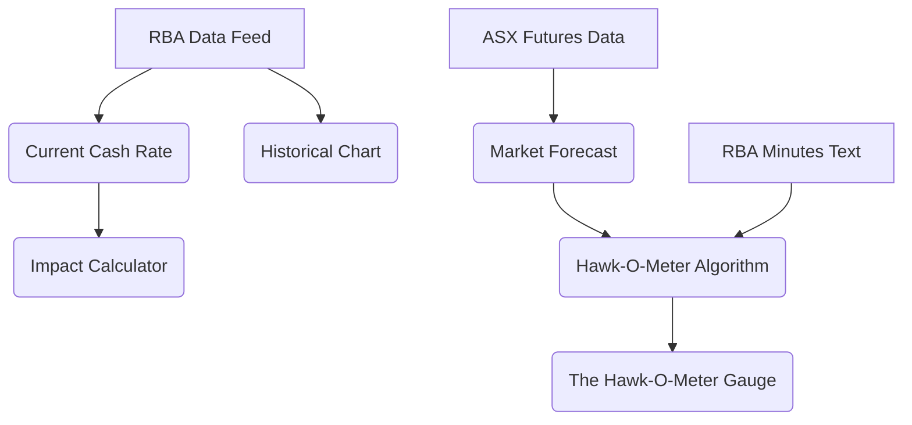

# Feature Landscape

**Domain:** Fintech / Economic Dashboard (Mortgage Focus)
**Researched:** 2024-05-22

## Table Stakes

Features users expect in any economic dashboard. Missing these makes the product feel incomplete or untrustworthy.

| Feature | Why Expected | Complexity | Notes |
|---------|--------------|------------|-------|
| **Current Cash Rate Display** | The core data point. Users need to know "where are we now?" immediately. | Low | Source directly from RBA. |
| **Historical Rate Chart** | Context is key. Users need to see the trend (up, down, flat) over 1yr/5yr/10yr. | Medium | Line chart. Needs interactive hover for specific dates. |
| **Next RBA Meeting Date** | "When does this change?" is the immediate follow-up question to "What is the rate?". | Low | Countdown timer or clear date display. |
| **Market Forecast (ASX Futures)** | The standard "prediction" source. Shows what the "smart money" thinks will happen. | Medium | Data integration with ASX 30-Day Interbank Cash Rate Futures. |
| **Mobile Responsiveness** | Personal finance is checked on phones. Non-negotiable. | Medium | Charts must scale/stack correctly on mobile. |
| **Data Source Citations** | Trust is paramount. "Data, not opinion" requires citing sources (RBA, ASX). | Low | Footer or clear labels near data widgets. |
| **Legal Disclaimer** | Regulatory requirement in Australia to distinguish "info" from "advice". | Low | Prominent "General Information Only" warning. |

## Differentiators

Features that make this specific tool valuable to *laypeople* (vs. economists).

| Feature | Value Proposition | Complexity | Notes |
|---------|-------------------|------------|-------|
| **The "Hawk-O-Meter" Gauge** | Visual synthesis of complex sentiment. Translates "Hawkish/Dovish" into "Traffic Light" (Red/Green/Amber). | High | The core IP. Requires an algorithm to weight RBA minutes + Futures data. |
| **"Plain English" Translator** | Decodes central bank speak. e.g., "Monetary policy tightening" → "Rates going up". | Medium | Tooltips or side-by-side translation of RBA statements. |
| **Impact Calculator** | Personalizes the abstract rate. "If rates go up 0.25%, my payment goes up $X". | Medium | Simple mortgage calc (Principal & Interest). No login required. |
| **Scenario Planner** | Empowerment. "What if rates go to 6%? Can I afford it?" | High | Slider UI affecting the Impact Calculator. |
| **"Sentiment" Timeline** | Shows *change* in RBA language over time, not just rate changes. | High | NLP analysis of RBA minutes (e.g., word clouds or sentiment score). |

## Anti-Features

Features to explicitly NOT build to avoid regulatory pitfalls (ASIC RG 244) and scope creep.

| Anti-Feature | Why Avoid | What to Do Instead |
|--------------|-----------|-------------------|
| **"You Should Fix" Recommendation** | Constitutes "Personal Financial Advice" (requires AFS License). High legal risk. | Show data: "Market prices in a peak of X% in June." Let user decide. |
| **Direct Product Comparison** | Shifts focus from "Macro Economic Tool" to "Lead Gen Site". Dilutes "Unbiased" value. | specific lenders/products. Keep it about *market averages*. |
| **"Best Rate" Tables** | Quickly becomes outdated and biased by referral fees. | Link to external comparison sites if monetization is needed, but keep core tool clean. |
| **User Accounts/Login** | Increases friction and privacy liability (holding financial data). | LocalStorage for saving calculator inputs (stateless app). |
| **Opinionated Blog/News** | Violates "Data, not opinion" core value. | Aggregate news headlines or link to official RBA statements only. |

## Feature Dependencies

## MVP Recommendation

For MVP, prioritize the "Information Radiator" aspect over complex interactivity.

1.  **Current Cash Rate & Next Meeting Date** (Table Stakes)
2.  **The "Hawk-O-Meter" Gauge** (Primary Differentiator - even if logic is simple initially)
3.  **Basic Impact Calculator** (Personalization)
4.  **ASX Futures Probability** (Credibility)

**Defer to post-MVP:**
- NLP/Sentiment analysis of RBA minutes (Manual sentiment scoring is fine for MVP).
- Complex Scenario Planner (Basic calculator covers 80% of use cases).

## Regulatory Guardrails (Australia)

**ASIC RG 244 (Factual Information vs. Advice):**
- **Safe Zone:** "The market predicts rates will rise." (Factual info about market pricing).
- **Danger Zone:** "This means it is a good time to fix." (General/Personal Advice).
- **Design Constraint:** Use neutral language. "Market Expectation" instead of "Prediction". "Historical Impact" instead of "Future Warning".
- **Disclaimer:** Must be visible on every page, clarifying the tool is for educational/informational purposes only.

## Sources

- [ASIC RG 244 - Giving information, general advice and personal advice](https://asic.gov.au/regulatory-resources/financial-services/giving-financial-product-advice/giving-information-general-advice-and-personal-advice/)
- [ASX RBA Rate Tracker (Competitor Analysis)](https://www.asx.com.au/markets/trade-our-cash-market/asx-interest-rate-market/rba-rate-tracker)
- [Moneysmart: Financial Advice](https://moneysmart.gov.au/financial-advice)